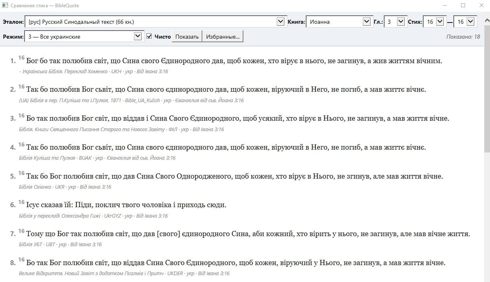
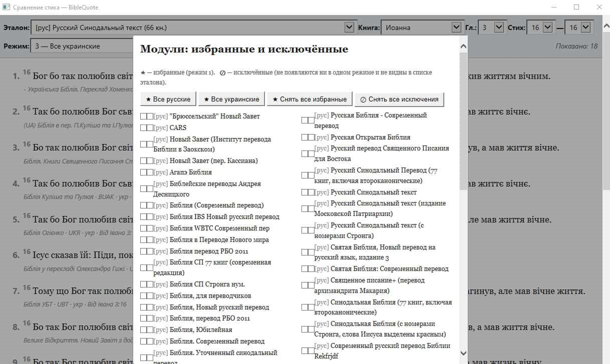
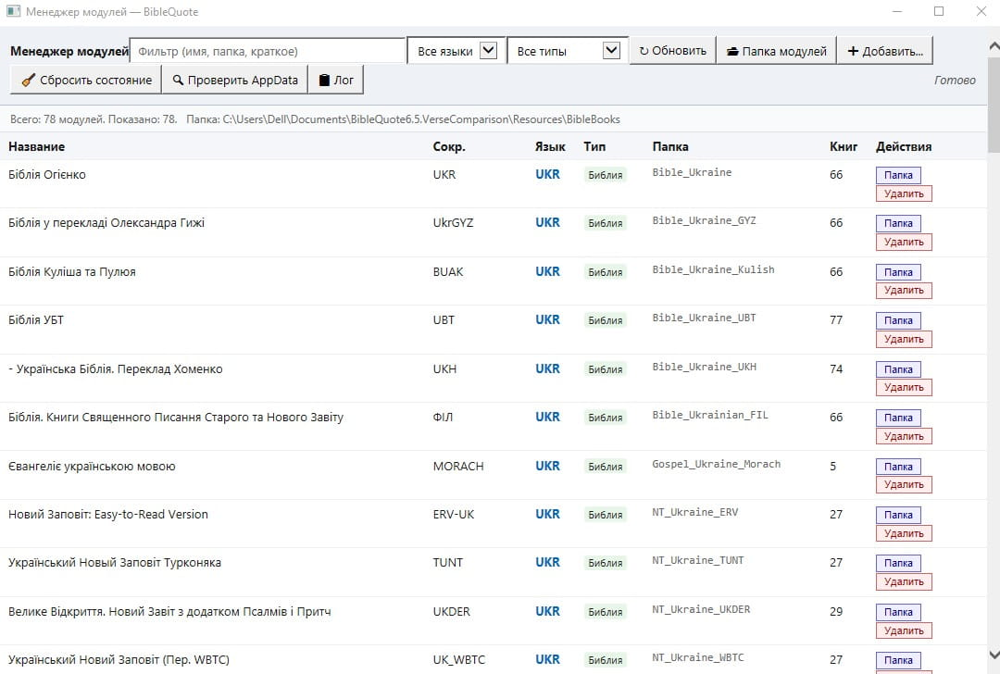

# BibleQuote 6.5 — Verse Comparison Tools

> Сторонние HTA-утилиты для BibleQuote 6.5: параллельное сравнение стихов между переводами и менеджер модулей. Два варианта — для портативной и для стандартной (установленной) BibleQuote.
> Third-party HTA utilities for BibleQuote 6.5: side-by-side verse comparison and a module manager. Two variants — for portable and for standard (installed) BibleQuote.

[Русский](#russian) · [English](#english)



---

<a id="russian"></a>

## Русский

### Что это

Две независимые утилиты для **BibleQuote 6.5**:

- **`СравнениеСтиха.hta`** — открывает один и тот же стих в нескольких переводах одновременно. Пять режимов выбора (избранные / все русские / все украинские / RU+UK / RU+UK+EN), сохранение настроек, поддержка номеров Стронга.
- **`mod_manager.hta`** — управление установленными модулями: просмотр, фильтр, поиск, добавление, удаление в Корзину, мягкий сброс состояния BibleQuote.

Утилиты **не модифицируют BibleQuote**. Это HTA-приложения (HTML+JavaScript), запускаемые встроенным в Windows `mshta.exe`. Никакой установки не требуется.

### Совместимость

- ✔ **BibleQuote 6.5** (целевая версия, например 6.5.20121206 BETA) — установщик `BibleQuote6.exe`, модули в `Resources\BibleBooks\`
- ✘ **Не подходит для BibleQuote 6.0** — структура папок и расположение модулей отличаются
- ✘ **Не работает с BibleQuote 7.x** — для этой ветки есть [отдельный репозиторий](https://github.com/it7fG/BibleQuote-VerseComparison-v7.5-Tools)

### Два варианта: какой брать

Структура репозитория:

```
BibleQuote-VerseComparison-v6.5-Tools/
├── Portable/   ← для портативной BibleQuote 6.5 (например, сборка mod83 или ваша личная распакованная)
│   ├── СравнениеСтиха.hta
│   └── mod_manager.hta
├── Standard/   ← для стандартной (установленной через инсталлятор) BibleQuote 6.5
│   ├── СравнениеСтиха.hta
│   └── mod_manager.hta
└── screenshots/
```

**Берите ту папку, в каком виде у вас BibleQuote:**

| У вас… | Признак | Берите |
|---|---|---|
| Портативная BibleQuote 6.5 | Папка лежит где угодно (Desktop, флешка), внутри есть подпапка `users\<имя_Windows>\` | `Portable/` |
| Стандартная установка | BibleQuote установлен через инсталлятор в `Program Files`, состояние в `%APPDATA%\BibleQuote\` | `Standard/` |

Логика и UI обоих вариантов идентичны. Отличие только в том, **откуда читается и куда пишется состояние** (избранные модули, последний стих, файлы для сброса). Если положить неподходящий вариант — он будет искать состояние не там, где BibleQuote его реально хранит.

### Установка

1. Подготовьте BibleQuote 6.5 (портативную или установленную).
2. Скопируйте из нужной подпапки этого репозитория **оба** `.hta`-файла (`СравнениеСтиха.hta` и `mod_manager.hta`) в корень папки BibleQuote — туда же, где `BibleQuote6.exe` и подпапка `Resources\`.
3. Запускайте двойным кликом. Никаких прав администратора не нужно для запуска самих утилит. Для стандартной установки в `Program Files` копирование `.hta`-файлов в эту папку потребует одноразового подтверждения UAC.
4. При первом запуске Windows может спросить разрешение для `mshta.exe` — это стандартный системный движок HTML-приложений, ничего ставить не нужно.

### Замечания для стандартной установки

**Папка `Resources\BibleBooks\` не создаётся установщиком BibleQuote 6.5** — её нужно создать вручную в `<install>\Resources\` и положить в неё папки модулей (или скопировать из портативной установки). Создание и копирование в `Program Files` потребует подтверждения UAC.

**Где BibleQuote хранит своё состояние.** Сама BibleQuote пытается писать в `<install>\users\<имя>\`, но из-за защиты Program Files Windows прозрачно перенаправляет запись в **VirtualStore**:

```
%LOCALAPPDATA%\VirtualStore\Program Files (x86)\<имя папки BibleQuote>\users\<имя>\
```

Пример: если BibleQuote установлена в `C:\Program Files (x86)\BibleQuote6.5\`, состояние окажется в `%LOCALAPPDATA%\VirtualStore\Program Files (x86)\BibleQuote6.5\users\<имя>\`.

Наш `mod_manager.hta` в варианте `Standard/` автоматически проверяет **оба места** (VirtualStore и саму установочную папку) и работает с тем, где файлы реально есть. Панель Лога показывает обоих кандидатов с отметкой «✔» у того, который существует.

**Права.** Что в `Standard/`-варианте работает без админа:

- ✔ **Чтение модулей и сравнение стихов**.
- ✔ **Сохранение избранных модулей и состояния утилит** — пишется в `%APPDATA%\BibleQuote\` (всегда писаемо).
- ✔ **Сброс состояния BibleQuote** — чистит VirtualStore или установочную папку (что найдёт).
- ⚠ **Добавление и удаление модулей в `Resources\BibleBooks\`** — потребует прав администратора. Иначе Windows перенаправит запись в VirtualStore-теневую копию и BibleQuote модуль не увидит. Если нужно часто добавлять/удалять модули — практичнее держать BibleQuote в писаемом месте (любая папка вне Program Files) и использовать `Portable/`-вариант.

### `СравнениеСтиха.hta`

Открывает один стих параллельно во всех выбранных переводах в одном окне.


**Пять режимов сравнения:**

| # | Режим | Что в выводе |
|---|---|---|
| 1 | Избранные | Только модули, отмеченные ★ в окне «Избранные…» |
| 2 | Все русские | Все модули с языком `ru` |
| 3 | Все украинские | Все `uk` |
| 4 | RU + UK | Объединение |
| 5 | RU + UK + EN | Плюс английский |

Чекбокс «Чисто» убирает номера Стронга и служебную разметку. В окне «Избранные…» два списка: ★ (избранные для режима 1) и ⊘ (исключённые из всех режимов).



**Особенности:**

- Кросс-скриптовое сопоставление имён книг (Jn ↔ Ин ↔ Iв)
- Поддержка кодировок UTF-8 (с BOM/без) и Windows-1251
- Автоматическая склейка длинных стихов, разбитых на несколько `<p>`
- Двухпроходный поиск книги: сначала по полному имени, затем по сокращениям — защищает от модулей с битым `ShortName`

### `mod_manager.hta`

Таблица всех модулей из `Resources\BibleBooks\` с фильтрами по языку, типу и текстовым поиском.



**Действия:** обновить список, открыть папку модулей, добавить модуль (через выбор папки), удалить модуль (в Корзину), сбросить состояние BibleQuote, открыть папку состояния (Standard) или проверить конфликтующие папки в `%APPDATA%` (Portable).

**Сброс состояния** очищает следующие файлы (с резервными копиями `.bak` рядом):

- `viewtabs.cfg`, `bibleqt_history.ini`, `hotmodules.lst`, `mru.lst`
- Удаляется строка `LastAddress=` из `bibleqt.ini`
- Удаляется кэш модулей `cached.lst` (BibleQuote пересоздаст)

Полезно если BibleQuote крашится при запуске или показывает «Не удалось разрешить избранный модуль».

**Проверка AppData (только Portable).** Портативная BibleQuote 6.5 не должна использовать `%APPDATA%`. Если там остались папки `BibleQuote*` от предыдущей стандартной установки, они могут мешать. Кнопка «🔍 Проверить AppData» находит их и предлагает переименовать в `*_old_backup_<дата>` (без удаления данных).

**Папка состояния (только Standard).** Открывает в Проводнике реальную папку состояния BibleQuote (VirtualStore или установочную — что найдёт). Состояние утилит сравнения хранится отдельно в `%APPDATA%\BibleQuote\`.

### Где хранится состояние

| Вариант | Состояние BibleQuote | Состояние утилит сравнения |
|---|---|---|
| **Portable** | `<папка BibleQuote>\users\<имя_Windows>\` | те же файлы рядом: `users\<имя>\_compare_*.txt` |
| **Standard** | `%LOCALAPPDATA%\VirtualStore\Program Files (x86)\<имя папки BQ>\users\<имя>\` (виртуализовано Windows) или `<install>\users\<имя>\` (если BQ запущена от админа) | `%APPDATA%\BibleQuote\_compare_*.txt` |

Файлы `_compare_favorites.txt`, `_compare_excludes.txt`, `_compare_state.txt` — обычные UTF-8, по одной папке модуля на строку. Можно редактировать вручную или переносить на другой компьютер вместе с остальным состоянием BibleQuote.

### Решение проблем

- **«Загружено модулей: 0»** — `.hta` лежит не в корне BibleQuote или нет подпапки `Resources\BibleBooks\`.
- **Модуля нет в списке `СравнениеСтиха.hta`** — проверьте, что в его `bibleqt.ini` есть `Bible=Y`. Если нет (это коммент. или словарь), он попадёт в `mod_manager.hta`, но не в сравнение.
- **Язык определился как `[?]`** — добавьте имя папки в `LANG_MAP` в верхней части `СравнениеСтиха.hta`.
- **После удаления модуля BibleQuote крашится** — нажмите «🧹 Сбросить состояние» в `mod_manager.hta` и перезапустите BibleQuote.
- **Не сохраняются избранные / не работает «Сбросить состояние»** — возможно, вы взяли не тот вариант (`Portable/` для стандартной установки или наоборот). Сверьтесь с таблицей в разделе «Два варианта».

### О BibleQuote

Это сторонний проект, **не связанный** с командой BibleQuote.

> [BibleQuote 7](https://github.com/BibleQuote/BibleQuote) — официальный репозиторий BibleQuote («Quote the Bible with confidence | Цитируй Библию уверенно»).  
> © BibleQuote.org, 2017–2024

Этот репозиторий содержит только утилиты-компаньоны для BibleQuote 6.5, не саму программу и не модули. Скачивайте программу и модули из соответствующих источников.

### Лицензия

Код и документация в этом репозитории — под [MIT License](./LICENSE). Лицензия распространяется только на файлы из этого репозитория, не на BibleQuote и не на модули.

---

<a id="english"></a>

## English

### What this is

Two standalone HTA utilities for **BibleQuote 6.5**:

- **`СравнениеСтиха.hta`** ("VerseComparison.hta") — opens the same Bible verse in multiple translations side-by-side. Five selection modes (favorites / all Russian / all Ukrainian / RU+UK / RU+UK+EN), persistent settings, Strong's number stripping.
- **`mod_manager.hta`** — module management: browse, filter, search, add, recycle-bin delete, soft BibleQuote state reset.

The utilities **do not modify BibleQuote**. They are HTA applications (HTML+JavaScript) launched by the Windows-built-in `mshta.exe`. No installation required.

### Compatibility

- ✔ **BibleQuote 6.5** (e.g., 6.5.20121206 BETA) — installer `BibleQuote6.exe`, modules in `Resources\BibleBooks\`
- ✘ **Not for BibleQuote 6.0** — different folder layout and module location
- ✘ **Does not work with BibleQuote 7.x** — see the [v7.5 repository](https://github.com/it7fG/BibleQuote-VerseComparison-v7.5-Tools)

### Two variants: which to pick

Repository layout:

```
BibleQuote-VerseComparison-v6.5-Tools/
├── Portable/   ← for portable BibleQuote 6.5 (e.g., the mod83 community build, or your own unpacked copy)
│   ├── СравнениеСтиха.hta
│   └── mod_manager.hta
├── Standard/   ← for the standard (installer-based) BibleQuote 6.5
│   ├── СравнениеСтиха.hta
│   └── mod_manager.hta
└── screenshots/
```

**Pick the folder matching your BibleQuote:**

| You have… | How to tell | Use |
|---|---|---|
| Portable BibleQuote 6.5 | Folder lives anywhere (Desktop, USB stick), contains a `users\<windows_user>\` subfolder | `Portable/` |
| Standard install | BibleQuote installed via the installer into `Program Files`, state in `%APPDATA%\BibleQuote\` | `Standard/` |

Logic and UI of both variants are identical. The only difference is **where state is read from and written to** (favorite modules, last verse, files for reset). Picking the wrong variant means the tool looks for state in a place BibleQuote does not actually use.

### Installation

1. Prepare BibleQuote 6.5 (portable or installed).
2. Copy **both** `.hta` files (`СравнениеСтиха.hta` and `mod_manager.hta`) from the appropriate subfolder of this repo into the root of the BibleQuote folder, next to `BibleQuote6.exe` and the `Resources\` subfolder.
3. Double-click to launch. No admin rights needed for the utilities themselves. For a standard install in `Program Files`, copying the `.hta` files there requires a one-time UAC confirmation.
4. On first launch Windows may prompt for `mshta.exe` permission — this is the standard system HTML application engine, nothing to install.

### Notes for the standard install

**The `Resources\BibleBooks\` folder is NOT created by the BibleQuote 6.5 installer** — you have to create it manually in `<install>\Resources\` and place module folders inside (or copy from a portable installation). Creating folders and copying into `Program Files` requires UAC confirmation.

**Where BibleQuote stores its state.** BibleQuote tries to write into `<install>\users\<user>\`, but because of Program Files protection Windows transparently redirects writes to **VirtualStore**:

```
%LOCALAPPDATA%\VirtualStore\Program Files (x86)\BibleQuote\users\<user>\
```

Our `mod_manager.hta` in the `Standard/` variant automatically checks **both locations** (VirtualStore and the install folder) and operates on whichever exists. The log panel shows both candidates with a “✔” next to the one that exists.

**Permissions.** What works in `Standard/` without admin:

- ✔ **Reading modules and verse comparison**.
- ✔ **Saving favorites and tool state** — written to `%APPDATA%\BibleQuote\` (always writable).
- ✔ **BibleQuote state reset** — cleans VirtualStore or the install folder (whichever it finds).
- ⚠ **Adding and deleting modules in `Resources\BibleBooks\`** — requires admin rights. Otherwise Windows will redirect the write into the VirtualStore shadow copy and BibleQuote will not see the new module. If you frequently add/remove modules, it is more practical to keep BibleQuote in a writable location (any folder outside Program Files) and use the `Portable/` variant.

### `СравнениеСтиха.hta` (VerseComparison)

Shows one verse across all selected translations in a single window.


**Five comparison modes:**

| # | Mode | Output |
|---|---|---|
| 1 | Favorites | Only modules marked ★ in the Favorites dialog |
| 2 | All Russian | All `ru` modules |
| 3 | All Ukrainian | All `uk` modules |
| 4 | RU + UK | Union |
| 5 | RU + UK + EN | Plus English |

The "Clean" checkbox strips Strong's numbers and metadata markup. The Favorites dialog has two lists: ★ (favorites for mode 1) and ⊘ (excluded from all modes).


**Features:**

- Cross-script book name matching (Jn ↔ Ин ↔ Iв)
- UTF-8 (BOM/no BOM) and Windows-1251 encoding support
- Automatic stitching of long verses split across multiple `<p>` blocks
- Two-pass book lookup (full name first, abbreviations as fallback) — guards against modules with broken `ShortName` fields

### `mod_manager.hta`

Table of all modules from `Resources\BibleBooks\` with language/type filters and free-text search.


**Actions:** rescan, open module folder, add a module (via folder picker), delete a module (recycle bin), reset BibleQuote state, open state folder (Standard) or check for conflicting `%APPDATA%` folders (Portable).

**State reset** clears the following files (with `.bak` backups alongside):

- `viewtabs.cfg`, `bibleqt_history.ini`, `hotmodules.lst`, `mru.lst`
- Removes the `LastAddress=` line from `bibleqt.ini`
- Deletes the modules cache `cached.lst` (BibleQuote rebuilds it)

Useful when BibleQuote crashes on startup or shows "Could not resolve favorite module".

**AppData check (Portable only).** Portable BibleQuote 6.5 should not use `%APPDATA%`. If `BibleQuote*` folders from a previous standard install remain there, they can interfere. The "🔍 Check AppData" button finds them and offers to rename them to `*_old_backup_<date>` (no data deletion).

**State folder (Standard only).** Opens the actual BibleQuote state folder in Explorer (VirtualStore or the install folder — whichever it finds). The comparison-tool state lives separately in `%APPDATA%\BibleQuote\`.

### Where state lives

| Variant | BibleQuote state | Comparison-tool state |
|---|---|---|
| **Portable** | `<BibleQuote folder>\users\<windows_user>\` | side-by-side: `users\<user>\_compare_*.txt` |
| **Standard** | `%LOCALAPPDATA%\VirtualStore\Program Files (x86)\<BQ folder name>\users\<user>\` (virtualized by Windows) or `<install>\users\<user>\` (if BQ runs as admin) | `%APPDATA%\BibleQuote\_compare_*.txt` |

The files `_compare_favorites.txt`, `_compare_excludes.txt`, `_compare_state.txt` are plain UTF-8, one module folder per line. Editable by hand, or portable along with the rest of BibleQuote's state.

### Troubleshooting

- **"Загружено модулей: 0"** ("0 modules loaded") — `.hta` is not in the BibleQuote root, or `Resources\BibleBooks\` is missing.
- **Module missing from VerseComparison** — check that its `bibleqt.ini` has `Bible=Y`. If not (commentary/dictionary) it appears in `mod_manager.hta` but not here.
- **Language detected as `[?]`** — add the folder name to `LANG_MAP` near the top of `СравнениеСтиха.hta`.
- **BibleQuote crashes after deleting a module** — click "🧹 Reset state" in `mod_manager.hta` and restart BibleQuote.
- **Favorites are not saved / "Reset state" does nothing** — you may have picked the wrong variant (`Portable/` for a standard install or vice versa). Check the table in "Two variants".

### About BibleQuote

This is a third-party project, **not affiliated** with the BibleQuote team.

> [BibleQuote 7](https://github.com/BibleQuote/BibleQuote) — the official BibleQuote repository ("Quote the Bible with confidence").  
> © BibleQuote.org, 2017–2024

This repository contains only companion utilities for BibleQuote 6.5, not the program itself and not the modules. Obtain the program and modules from their respective sources.

### License

Code and documentation in this repository are under the [MIT License](./LICENSE). The license covers only files in this repository, not BibleQuote and not the modules.
Ушло в Гитхаб